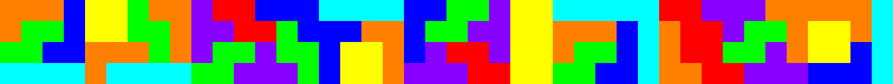
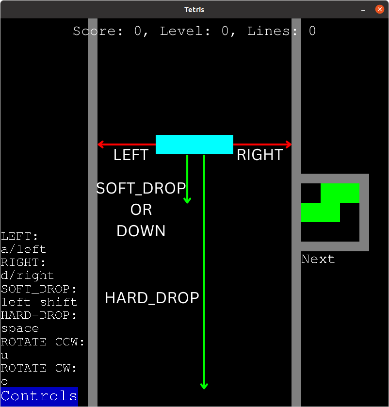

# Tetris3D!
Tetris3D is a Python, Pygame and Numpy script of 2D and 3D Tetris games. It's similar to NES Tetris but it's mixed with modernity. It first started as a personal project of Tetris in just 2D, then became my Portfolio Project for Holberton. It uses no 3D projection library, aand instead, does all of the 3D rendering with pygame and math alone.


## Features
- 2D and 3D modes
- NES point systems
- NES controls (mostly similar, since keyboards allow left+right)
- my own piece speeds and timeouts
- customizeable keyboard controls
- (bad) sounds
- modern piece colors.

## Anti-Features
- hold queue
- multiple next pieces
- modern gameplay
- fancy rendering techniques, like ray-tracing/marching or even rasterizing, but instead, is rendered in my own style. 

## Creator
Hello, I'm Gabriel Fernandez, the creator of this project. I first started programming in Python, in late 2019, and made my first small games in Pygame, from YouTube tutorials. I then started Holberton in September 2022, and chose Web Development as my Holberton Specialization.
### My Contacts
<a href="https://www.linkedin.com/in/gabriel-fernandez-415609278/" target="_blank">

</a>

<a href="https://twitter.com/gabe_programs" target="_blank">

</a>

My Portfolio Project
https://github.com/GABETROLL/Tetris3D/

## Story for Building this Project
### Inspiration
I started playing Tetris in 2018, after discovering it online. I first played it on mobile, but was quite terrible at it. After a little while, I found NES Tetris, and worked really hard to improve in it for a while in 9th grade, until 2019. Then, in summer 2019, I played Tetris99 for another little while. After that, I lost touch, but I still liked it.

In November 2019, I started programming with Pygame. Before that, I had only ever used Python, and only ever did text programs. I made my series of small programs there for 2 years in my Dad's desktop PC, with no knowledge of Git or GitHub, only using YouTube tutorials as my learning source. My first Pygame project was Snake.

For my Holberton Portfolio Project, I remembered my Snake project, and wanted to re-live Python+Pygame programming, but Snake would be too boring for a final project. Then, I remember my love for Tetris. I needed a twist for the game, and as I was discussing this with my classmates, I suddenly had the idea to make it 3D... I was only brainstorming, and said it half-jokingly, but I eventualy went with making it 3D. 2 months later, this project was finished!
### Building the Project
I didn't want to try to learn new tools, so I ended up having to render the 3D board from scratch. It still ended up being really fun figuring out how to. **This means this project lacks 3D rendering tools, and I think my rendering method may be flawed.** Of course, this ended up being a very big challenge.

When I had first built this project in 2021, I had decided to make the game have some features from NES Tetris, and some features from modern Tetris, but I wasn't thinking. When I started building it in 3D for Holberton, I made it my focus to make the gameplay have, in my opinion, a good balance of challenge, excitement, intensity and fun. **This means this game lacks modern Tetris features.**

## Requirements
<a href="https://www.python.org/"></a>

(This project was developed in version 3.11)\
Install on Debian/Debian-based Linux:
```
$ sudo apt install build-essential checkinstall \
    libreadline-gplv2-dev  libncursesw5-dev libssl-dev \
    libsqlite3-dev tk-dev libgdbm-dev libc6-dev libbz2-dev
$ sudo add-apt-repository ppa:deadsnakes/ppa
$ sudo apt install python3.11
```
Verify Python3.11 is installed:\
Linux:
```
$ python3.11 -m pip --version
```
Windows:
```
$ python -m pip --version
```
### PIP


https://pip.pypa.io/en/stable/installation/

-or-

https://packaging.python.org/en/latest/tutorials/installing-packages/#ensure-you-can-run-pip-from-the-command-line
### Git
<a href="https://git-scm.com/downloads"></a>

Git Logo by Jason Long

On Debian-based Linux:
```
$ sudo apt install git
```
## Installation
```
$ git clone git@github.com:GABETROLL/Tetris3D.git
$ cd Tetris3D/
```
### Install Pygame and Numpy
#### Easy script:
```
$ pip install -r requirements.txt
```
(I used the versions in the ``requirements.txt`` file)

Or do it youeself:

<a href="https://www.pygame.org/wiki/GettingStarted"></a>

(logo by TheCorruptor and Mega_JC)

<a href="https://numpy.org/"></a>

## Run
```
$ python3.11 main.py
```
## Rules
The purpose of this project was not to copy modern Tetris, but to make a Tetris game that I enjoy the most.
This game is not "up to standard" with the Modern Tetris point system, level speed system, and Super Rotation System.
Instead, I made this game more like what I wish Tetris was like.
This game has its own simpler rotation system, and my preferences for level speeds and points.

There are 2 ame types: 2D and 3D.
The game starts off with:
- a board
    If the game mode is 2D, the board is 10 x 20.
    If the game mode is 3D, the board is 4 x 4 x 20.
    
    
- a random piece, spawned at the top of the board, that the player can control and drop. It falls every N frames, N being faster the higher the level
- a next piece preview.
    It can rotate in 2 directions when the game mode is 2D, and 6 directions when it's 3D.
- a level that determines the speed the pieces fall in

The player can control this piece by:
- moving it in any horizontal direction,
- lower it gradually (SOFT-DROP),
- teleport it to its landing position (HARD-DROP)
- rotating it in the available axii

Every N frames, the piece moves one block down, to fall. If the current level is higher, the piece falls faster.\
The amount of frames a piece waits before it drops looks like this:
| level | frames |
| ----- | ------ |
| 0 | 50 |
| 1 | 45 |
| 2 | 41 |
| 3 | 37 |
| 4 | 34 |
| 5 | 31 |
| 6 | 28 |
| 7 | 26 |
| 8 | 23 |
| 9 | 21 |
| 10 | 19 |
| 11 | 18 |
| 12 | 16 |
| 13 | 15 |
| 14 | 13 |
| 15 | 12 |
| 16 | 11 |
| 17 | 10 |
| 18 | 9 |
| 19 | 9 |
| 20 | 8 |
| 21 | 7 |
| 22 | 7 |
| 23 | 6 |
| 24 | 5 |
| 25 | 5 |
| 26 | 5 |
| 27 | 4 |
| 28 | 4 |
| 29 | 4 |
| 30 | 3 |
| 31 | 3 |
| 32 | 3 |
| 33 | 3 |
| 34 | 2 |
| 35 | 2 |
| 36 | 2 |
| 37 | 2 |
| 38 | 2 |
| 39 | 2 |
| 40 | 2 |
| 41 | 1 |

When a piece lands on top of another block, or the bottom of the board, the piece displayed in the next piece preview spawns as the current piece, and a new 'next piece' gets spawned. This process could go on forever.

When a whole row/floor gets full, that row/floor gets removed from the board, and gets counted to the score. The amount of lines cleared determines the score gained, like this:
| lines | points |
| ----- | ------ |
| 0     | 0      |
| 1     | 40     |
| 2     | 100    |
| 3     | 300    |
| 4     | 1200   |

If a player clears a certain amount of lines, the game "transitions": the level increases, then the levels keep increasing every 10 lines.

The goal is to get as much points as possible, before the pieces stack too high.

When the 'next piece' tries to spawn at the top of the board as the new current piece, but any block in the board blocks it, the game ends.

## Keyboard Controls
The keyboard controls' settings can be found in ``keyboard_settings.json``.
### Controls's Definitions
In ``keyboard_settings.json``, the keys are the following:
The "LEFT", "RIGHT", "UP" and "DOWN" keys are meant to represent a D-pad in the player's (your) keyboard;

"menu_submit" is the control for "Play!";

the "rotate_cw_x", "rotate_cw_y" and "rotate_cw_z" keys are for rotating clockwise AROUND x, y and z;

the "rotate_ccw_x", "rotate_ccw_y" and "rotate_ccw_z" keys are for rotating counter-clockwise AROUND x, y and z;

"toggle_controls_screen" toggles the controls screen;

and the "HARD_DROP" and "SOFT_DROP" keys do what's explained above, in the [##Rules](##Rules) section.

In 2D, the "LEFT" and "RIGHT" keys move the piece left and right,
"DOWN" and "SOFT_DROP" soft-drop the piece,
and "HARD_DROP" hard-drops it



In 3D, UP and DOWN move the piece back and front,
and "SOFT_DROP" and "HARD_DROP" work exactly as their names.


### Edit The Keyboard Controls


Click on the "Controls" button anywhere but the controls' screen. That button will take you to the controls screen, where you can see the list of all of the in-game actions, and their keys.

To edit a control, click the control ROW (to tell if your mouse is on top of it, just make sure it turns yellow) and press the key to do that function.

This should not only change the controls in the current gameplay, but should save the settings to the 'keyboard_settings.json' as well, IF THE PLAYER DOESN'T KILL THE PROCESS, USE Ctrl+C IN THE TERMINAL, OR HAVE THE PROGRAM CRASH UNPEXPECTEDLY.

## Feedback
ALL FEEBACK IS WELCOME. Please tell me all of the issues, bugs, ideas, changes, etc.. you have with my project, and don't change anything without my permission! If you know how to set up permissions in GitHub, please let me know as well! Thank you, and God bless you!

## Code Documentation
### File Structure & Definitions
```
game/
    score.py
        Score
    move_data.py
        LEFT
        RIGHT
        SOFT_DROP
        HARD_DROP
        BACK
        FRONT
        MOVES_2D
        MOVES_3D
    game_2d.py
        I
        J
        L
        O
        S
        T
        Z
        ROWS: int
        COLUMNS: int
        Piece2D
        Game2D
            pieces = [I, J, L, O, S, T, Z]
            piece: Piece2D
            next_piece: Piece2D
            score_manager: Score
    game_3d.py
        I_3D
        J_3D
        L_3D
        O_3D
        S_3D
        T_3D
        Z_3D
        FLOOR_WIDTH: int
        FLOORS: int
        Piece3D
        Game3D:
            piece: Piece3D
            next_piece: Piece3D
            score_manager: Score
game_control.py
    GameControl
        game: Game2D
        das: dict[str, int]
    GameControl2D(GameControl)
    GameControl3D(GameControl)
main.py
    Menu
    Window
        controls: GameControl
        game_options_menu: Menu

```
### Object Structure
(relative to ``main.py``)
```
Menu
    options: object
    option_index: int
    option -> options[option_index]

Window
    window: pygame.Surface
    BOARD_HEIGHT: int
    HEIGHT: int = BOARD_HEIGHT
    WIDTH: int = HEIGHT

    window: pygame.Surface
    clock = pygame.time.Clock()
    fps: int
    running: bool = True

    font: pygame.font.Font

    level_menu = Menu(range(20))
    mode_menu = Menu(("2D", "3D"))
    music_menu = Menu(("Tetris Theme", "Silence"))
    game_options_menu = Menu((self.level_menu, self.mode_menu, self.music_menu))

    controls: GameControl
        window: pygame.Surface
        game: Game2D | Game3D
            piece: Piece2D | Piece3D
                pos: <2D | 3D pos>
                color: <color>
            next_piece: Piece2D | Piece3D
            board: dict[<2D pos>, <color>] | dict[<3d pos>, <color>]
        das: dict

    frame_handler: bound method
    """
    current "mode" the program is in,
    a method that will be called each frame.
    The methods can be:
    'self.handle_title_screen_frame',
    'self.handle_game_frame',
    'self.handle_game_over_screen_frame'
    """

    game_over_menu =  Menu(("Back to title screen", "Quit"))
        
```
